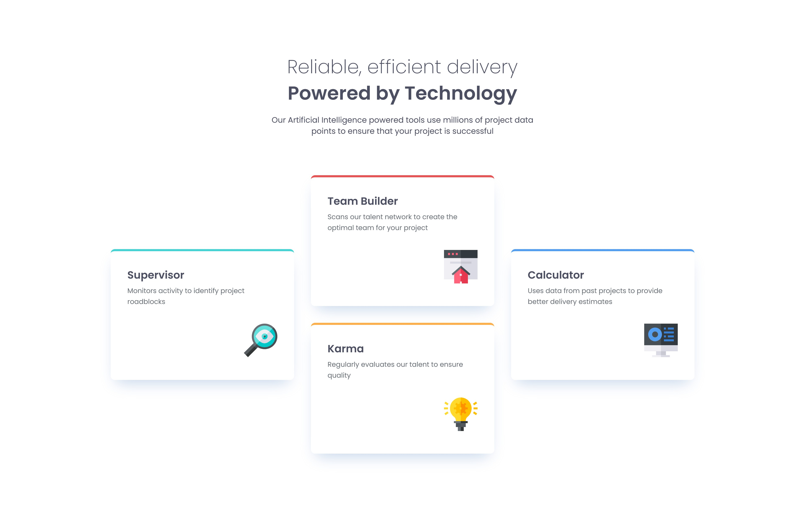

# Frontend Mentor - Four Card Feature Section 

## Table of contents

- [Overview](#overview)
  - [The challenge](#the-challenge)
  - [Screenshot](#screenshot)
  - [Live preview](#live-preview)
  - [Solution retrospective](#solution-retrospective)

## Overview

### The challenge

The challenge was to build out a feature section and get it looking as close to the design as possible.

### Screenshot

### Live preview

- Live Site URL: [Live preview](https://marioncts.github.io/Four-Card-Feature-Section/)

### Solution retrospective

For this challenge, I wanted to practice a responsive approach by using the clamp property for text and margin-block/margin-inline instead of the traditional margin-bottom/margin-left properties. This is particularly useful when a page needs to be translated into a right-to-left (RTL) language, for example.

I had a bit of trouble understanding how the clamp property works, but I managed to figure it out and I got the result to be as close as possible to the original design.

I would be grateful for any kind of feedback!
